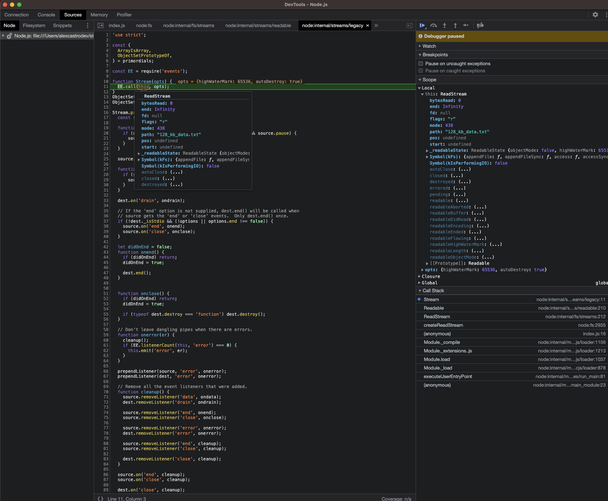

# Streams

The node core steram module exposes 6 constructor for streams:

- Stream
- Readable
- Writable
- Duplex
- Transform
- PassThrough

```bash
LFW211 git:(main) ✗ node -p "stream + ''"
function Stream(opts) {
  EE.call(this, opts);
}
```



The stream output

```bash

<ref *1> [Function: Stream] {
  isDisturbed: [Function: isDisturbed],
  isErrored: [Function: isErrored],
  isReadable: [Function: isReadable],
  Readable: [Function: Readable] {
    ReadableState: [Function: ReadableState],
    _fromList: [Function: fromList],
    from: [Function (anonymous)],
    fromWeb: [Function (anonymous)],
    toWeb: [Function (anonymous)],
    wrap: [Function (anonymous)]
  },
  Writable: [Function: Writable] {
    WritableState: [Function: WritableState],
    fromWeb: [Function (anonymous)],
    toWeb: [Function (anonymous)]
  },
  Duplex: [Function: Duplex] {
    fromWeb: [Function (anonymous)],
    toWeb: [Function (anonymous)],
    from: [Function (anonymous)]
  },
  Transform: [Function: Transform],
  PassThrough: [Function: PassThrough],
  pipeline: [Function: pipeline] {
    [Symbol(nodejs.util.promisify.custom)]: [Getter]
  },
  addAbortSignal: [Function: addAbortSignal],
  finished: [Function: eos] {
    finished: [Function: finished],
    [Symbol(nodejs.util.promisify.custom)]: [Getter]
  },
  destroy: [Function: destroyer],
  compose: [Function: compose],
  promises: [Getter],
  Stream: [Circular *1],
  _isUint8Array: [Function: isUint8Array],
  _uint8ArrayToBuffer: [Function: _uint8ArrayToBuffer]
}
```

The Prototype of Stream is Event emitter

```bash
LFW211 git:(main) ✗ node -p "stream.__proto__"
<ref *1> [Function: EventEmitter] {
  once: [AsyncFunction: once],
  on: [Function: on],
  getEventListeners: [Function: getEventListeners],
  EventEmitter: [Circular *1],
  usingDomains: false,
  captureRejectionSymbol: Symbol(nodejs.rejection),
  captureRejections: [Getter/Setter],
  EventEmitterAsyncResource: [Getter],
  errorMonitor: Symbol(events.errorMonitor),
  defaultMaxListeners: [Getter/Setter],
  setMaxListeners: [Function (anonymous)],
  init: [Function (anonymous)],
  listenerCount: [Function (anonymous)]
}
➜  LFW211 git:(main) ✗ node -p "stream.prototype"
EventEmitter { pipe: [Function (anonymous)] }
```

The only thing the Stream constructor implements is the pipe method.

The main events emitted by various Stream implementations that one may commonly encounter in application-level code are:

data
end
finish
close
error

# Stream modes

- Binary stream ( default mode )
- Object stream

Readable streams are usually connected to an I/O layer via a C-binding, but we can create a contrived readable stream ourselves using the Readable constructor:


### Extra

16_kb_data.txt

The CSV file I provided contains 17 lines, including the header row. Each line contains the name of a pet, their age, and their location, separated by commas. Each character in the file takes up one byte of storage space.

So, to calculate the size of the file in kilobytes, we can use the formula:

File Size (in KB) = Number of Bytes / 1024

The total number of bytes in the file can be calculated by adding up the byte size of each character in the file, including the line breaks. Assuming a newline character (\n) is added at the end of each line, the total byte size of the file would be:

(5 + 1 + 9 + 1 + 8) * 17 = 408 bytes

Converting this to kilobytes using the formula above, we get:

File Size (in KB) = 408 / 1024 = 0.3984375 KB

Rounding this up to two decimal places, we get a file size of approximately 0.40 KB or 400 bytes. Since 1 KB equals 1024 bytes, 16 KB would be equal to 16 * 1024 = 16,384 bytes. Therefore, we would need to generate a CSV file with approximately 16,384 / 17 = 964 lines to reach a file size of 16 KB.


# Extra 2

In Node.js, FixedQueue is not a built-in data structure, but it might refer to a custom implementation of a fixed-size queue data structure.

A queue is a collection of elements that allows adding new elements at one end (the tail) and removing elements from the other end (the head). A fixed-size queue has a predetermined maximum capacity, and when that capacity is reached, adding a new element will result in the oldest element being removed to make room for the new one.

In such an implementation, the head and tail are two pointers that keep track of the position of the oldest and newest elements, respectively. The head is the pointer to the front of the queue, while the tail is the pointer to the back of the queue.

When a new element is added to the queue, it is added to the tail, and the tail pointer is advanced. If the queue is already at maximum capacity, the head pointer is advanced, and the oldest element is removed from the queue.

Similarly, when an element is removed from the queue, it is removed from the head, and the head pointer is advanced. If the queue is already empty, attempting to remove an element will result in an error.

Overall, a fixed-size queue can be useful when there is a need to limit the number of elements in a queue or when the size of the queue is known in advance.


