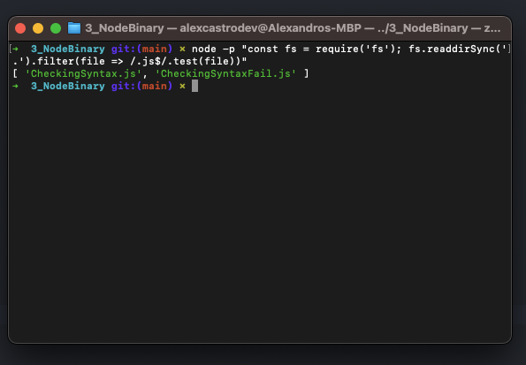

# Printing commands

All Node Command line flags for any Node's version.

```bash
node --help
```

Beyond the Node command line flags there are additional flags for modifying the JavaScript runtime engine: V8

```bash
node --v8-options
```

# Checking Syntax

## Correct 

```bash
node -c appFail.js
```

Dont show errors


## Incorrect 

```bash
node -c appFail.js
```

function something {
                   ^

SyntaxError: Unexpected token '{'

# Dynamic Evaluation

You can evaluate code with -p or --print and ```print the result```, the -e  or --eval flag evaluates without printing the result of expression.

### Evaluated results of expression with print

```bash
➜  ~ node -p 1+1
2
```

```bash
➜  ~ node -p 1+"1"
2
```

```bash
➜  ~ node -p "1"+"1"
2
```

```bash
➜  ~ node -p "1"+"2.0"
3
```

```bash
➜  ~ node -p "console.log(1+200)" 
201
undefined // => this is because console.log returns undefined
```

```bash
➜  ~ node -e  "console.log(1+'a')"
1a
```


### Evaluated results of expression without print


```bash
➜  ~ node -p 1+1
```

```bash
➜  ~ node -e  "console.log(1+200)"   
201 // => console.log is used to explicitly write the result of 1+1 to the terminal:
➜  ~ node -e  "1+1"               
➜  ~ 
```

### Errors

```bash
➜  ~ node -p "1"+"2.0"
3
➜  ~ node -p "console.log(1+"a")"
[eval]:1
console.log(1+a)
              ^

ReferenceError: a is not defined
    at [eval]:1:15
```

### Running fs on console

You can also use a ```require``` to import a module, for example, i want to import File System Script, and read files on current dir.

Usually, you think to use something like this: 

```javascript
// Import the fs module
const fs = require('fs'); 

// Read files
const files = fs.readdirSync('.').filter(file => /.js$/.test(file))

// Print array of values
console.log(files)
"
```

But you can print on your terminal, like this:

```bash
node -p "const fs = require('fs'); fs.readdirSync('.').filter(file => /.js$/.test(file))"
```




### Extras Study

OBS: The implementation on NodeJS, is different depending on OS.
Windows use dir, Linux ls, etc...

NodeJS uses internalBinding to call module FS

Here's a NodeJS Source Notes: 

// - internalBinding(): the private internal C++ binding loader, inaccessible

//   from user land unless through `require('internal/test/binding')`.

//   These C++ bindings are created using NODE_MODULE_CONTEXT_AWARE_INTERNAL()

//   and have their nm_flags set to NM_F_INTERNAL.


# Preloading CommonJS Modules

The command flag -r or --require can be use to preloaded a cjs module before anything else loads.
I created 2 files, ```preloaded.js``` and ```afterPreloaded.js```.

if i just run:

```bash
node afterPreloaded.js
```

Will fail with error:
console.log(name)
            ^
ReferenceError: name is not defined

But if i run with --require


OBS: This wont work with ESM Module.
ESM uses ```--loader``` flag.

Source: https://nodejs.org/docs/latest-v16.x/api/esm.html#loaders

### Extra Study

-r, --require module#
Added in: v1.6.0
Preload the specified module at startup.

Follows require()'s module resolution rules. module may be either a path to a file, or a node module name.

Only CommonJS modules are supported. Use --import to preload an ECMAScript module. Modules preloaded with --require will run before modules preloaded with --import.


in our preloaded we dont have console.log, but why does it happen?

```bash
➜  3_NodeBinary git:(main) ✗ node --require ./preloaded.js afterPreloaded.js
preload.js: this is preloaded
---------Preloaded HEAD---------
➜  3_NodeBinary git:(main) ✗ 
```

This is what dotenv/config works, to set env in our environments.

You can check here: https://github.com/motdotla/dotenv/blob/master/config.js


# Stack Track Limit

When we run our file Stack Trace, the whatevercalc will run 100x, and will throw error when reach 0.

```bash
node StackTraceLimit.js

if (n === 0) throw Error()
               ^
Error
```

We can limit or increase our stack trace, like:

```bash
➜  3_NodeBinary git:(main) ✗ node --stack-trace-limit=1 StackTraceLimit.js
/3_NodeBinary/StackTraceLimit.js:2
  if (n === 0) throw Error()
               ^

Error
    at whateverCalc (/3_NodeBinary/StackTraceLimit.js:2:22)

Node.js v18.12.1

➜  3_NodeBinary git:(main) ✗ node --stack-trace-limit=101 StackTraceLimit.js

    // Deleted others 98 lines
    // Test this by yourself
    at whateverCalc (/3_NodeBinary/StackTraceLimit.js:3:3)
    at Object.<anonymous> (/3_NodeBinary/StackTraceLimit.js:6:1)

Node.js v18.12.1
➜  3_NodeBinary git:(main) ✗ 
```

Generally, the stack trace limit should stay at the default in production scenarios due to the overhead involved with retaining long stacks. It can nevertheless be useful for development purposes.