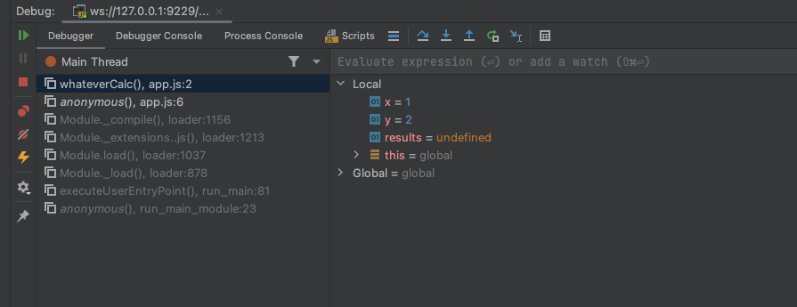
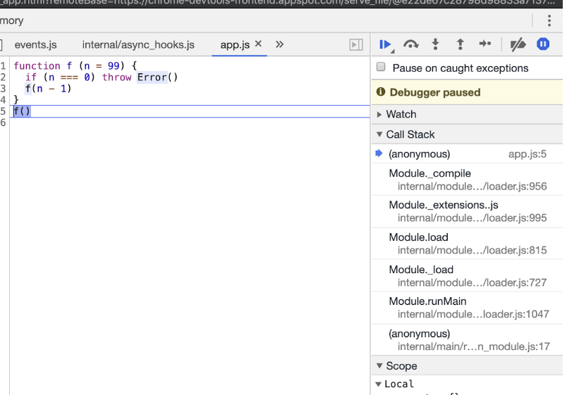

# Starting in Inspect Mode

Here we gonna use Chrome devtools remote debugging protocol. Because we need a client that supports the protocol.

We will use the `inspect` command to start the remote debugging protocol.

```bash
node --inspect app.js
```

If you dont set a breakpoint, code will run and finish.

In my case, when i set a breakpoint in the line 2, VSCode shows variables, but webstorm does not.

To enable a continuous inspect server, you should use `inspect-brk`

```bash
node --inspect-brk app.js
```

Now, webstorm shows the breakpoint:



I Think Vscode has some setting ( using launch.json ), that you can inspect with inspect-brk. I'll check it later. ( solved, i will explain later )

Linux foundation how you can use inspect in your chrome.

So open this URL:

chrome://inspect/#devices

And after click on inspect, devtools open ( and here my vscode detected the debugger and active debug mode )

BTW, i have a setting called `debug: auto-attach`.

# Breaking on Error in devtools

In this section, nothing new... at least for me, just the `Pause on caught exceptions` flag, i never heard before.

It will save my life in next development :D



Notes from tutorial:

From here the Call Stack can be explored over in the right hand column and state can be analyzed by hovering over any local variables and looking in the Scope panel of the right hand column, located beneath the Call Stack panel.

Sometimes a program will throw in far less obvious ways. [ Maybe here can talk about frameworks, or Frontend lib that run a lot of loop and process before throw error] In these scenarios the "Pause on exceptions" feature can be a useful tool for locating the source of an exception.

# Adding a Breakpoint in Devtools

Nothing new... you can click in some line, and set a new breakpoint.

You can put a `debugger` keyword in your code, and will work like a breakpoint in some line.

You can check in `app.js`