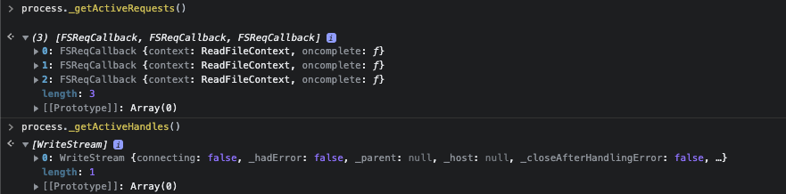
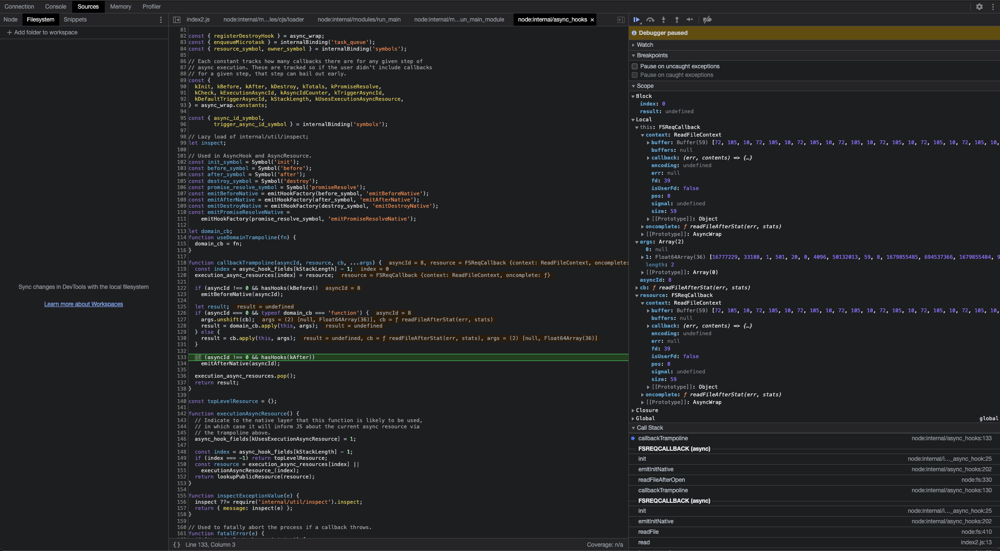

# Callbacks

Callbacks is a function that will be called at some future point, once a task has been completed.

For example: index.js has a readFile, that will follow this steps: 

- Will validate you callback if is a typeof function

- Read the options you pass

- will create a ReadFileContext Class that read the buffer of the file

- will use FSReqCallback ( Extra 1 )

- when FSReqCallback end, will call oncomplete function

- oncomplete is your callback and will be executed


But, isn't it synchronous instead asynchronous ? Kinda.

Imagine you have 3 files, synchronous proccess will read first file, execute callback, read second, execute callback, read third, execute callback.

TLTR: Node will schedule the callbacks, will proccess all Buffers, and the callback will be executed in the order of the ending proccess.

Check in index2.js

When third read executes, the read buffer will be execute yet, because we have 3 Schedule Callback Queue

You can check using debugger and execute line by line with --inspect-brk


```bash
node --inspect-brk index2.js
```

when you reach last line, write this in console: ```process._getActiveRequests()```

You will get this:




When last line ran, Node will continue the process and call ```callbackTrampoline``` like this pic (Extra #2)



Something i notice, when i put 30mb of content on file_size_2, the callback_queue only start to process when all Buffers were read.

And when all FSReqCallback had Buffers, it start to show data on console.log by process order.

Training portal explanation:

On line two smallFile, mediumFile, and bigFile are mocked (i.e. it's pretend) and they're actually all the same file. The actual file they point to doesn't matter, it only matters that we understand they represent different file sizes for the purposes of understanding.

If the files were genuinely different sizes, the above would print out the contents of smallFile first and bigFile last even though the readFile operation for bigFile was called first. This is one way to achieve parallel execution in Node.js.

Serial execution with callbacks is achieved by waiting for the callback to call before starting the next asynchronous operation.

Callback-based serial execution can become quite complicated, quite quickly. Using a small library to manage the complexity is advised. One library that can be used for this is fastseries

https://www.npmjs.com/package/fastseries

# Extra 1

In Node.js, the internalBinding('fs') method is used to obtain a reference to the underlying implementation of the fs module.

The fs module is a built-in Node.js module that provides an API for working with the file system. The internalBinding() method allows access to the internal implementation of this module, which may be useful for certain advanced use cases such as debugging or modifying the behavior of the module.

It is worth noting that the internalBinding() method is considered an internal Node.js API and is not intended for general use. It is subject to change without notice, and using it may lead to unexpected behavior or even breakage of your application. Therefore, it is recommended to use the public API provided by the fs module unless you have a specific need to use internalBinding().

# Extra 2

In Node.js, a callback trampoline is a technique used to handle long-running, asynchronous operations without causing a stack overflow.

When a function that performs an asynchronous operation is called, it typically takes a callback function as an argument. Once the operation is complete, the callback function is called with the result of the operation. However, if the callback function itself performs another asynchronous operation and calls another callback function, this can lead to a stack overflow if this process continues indefinitely.

To avoid this, Node.js uses a callback trampoline to manage the callback functions. When a callback function is called, instead of being executed immediately, it is added to a queue of pending callbacks. The event loop then processes the callbacks in the queue one by one, invoking each one in turn.

By using a trampoline, Node.js can ensure that only one callback is processed at a time, even if there are multiple callbacks waiting to be executed. This prevents the stack from overflowing and allows Node.js to handle large numbers of asynchronous operations efficiently.

# Extra 3

In Node.js, _getActiveHandles() is a method provided by the process module that returns an array of currently active handles.

Handles in Node.js are objects that represent operating system resources such as file descriptors, timers, sockets, and child processes. They are created by Node.js when certain asynchronous operations are initiated and are used to manage and monitor those operations.

The _getActiveHandles() method returns an array of all the currently active handles in the Node.js process, including those created by the Node.js core and those created by third-party modules. This can be useful for debugging purposes, as it allows developers to inspect the state of the Node.js process and identify any potential issues related to handle leaks or improper handle management.

