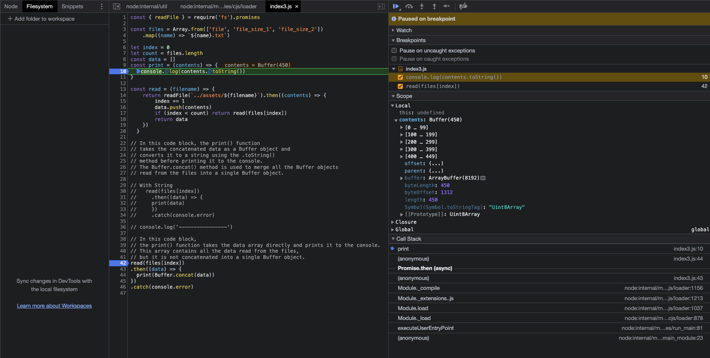
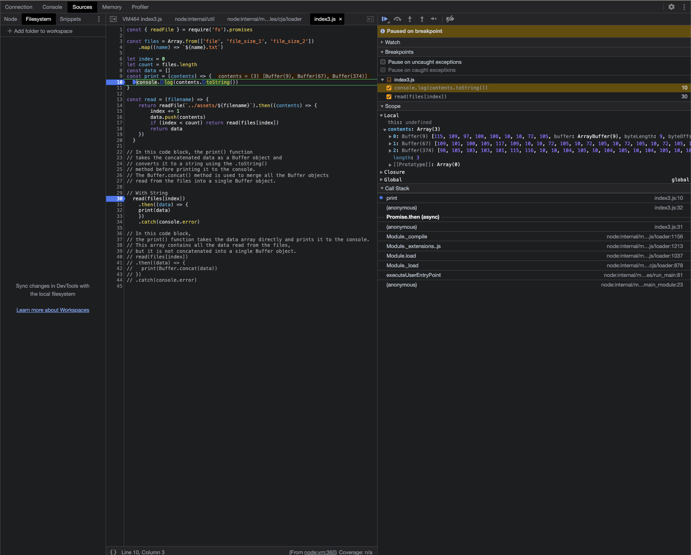

# Promises

A Promises represents an asyncronous operation. 

A Promise can only Resolve the Operation or Reject.

The status when it's not Resolved or Rejected is ```Pending```, otherwise, ```settled```.

OBS: 
Example between callback and promise on index.js

The Promisify in ```index2.js```, for example, takes the original callback.

for example, in the readFile that after read the results is the contents. So, when we use node:util => promisify, this will:

- Validate the cb function
- Check if original function has already promisified using the symbol kCustomPromisifiedSymbol
- name the arguments to a variable
- create a function  with the args, and return a new Promise
- use ObjectSetPrototypeOf to set the prototype of original callback, to function created above

example about setPrototypeOf:
```javascript
const obj1 = { a: 1 };

const obj2 = { b: 2 };

Object.setPrototypeOf(obj2, obj1);

console.log(obj2.a);
```

- Creates a new object to define the function definition, name, descriptors, and propertiesValues
- Use ObjectDefine to update the function length, name and prototype

Here's an example to use defineProperties.

```javascript
const obj1 = { a: 1 };

const obj2 = { b: 2 };

Object.setPrototypeOf(obj2, obj1);

console.log(obj2.a);

Object.defineProperties(obj2, {
  a: {
    value: 3
  }
})

obj2.a
```

And this is the definition of Node Promisify.

In the ```index3.js```, has an example about fs promises, and buffer.

But note that we have to handle with index, count and data. It's not good to have this complexity. So look the difference between ``ìndex3.js```and ``ìndex4.js```.

Same thing, but better.

The ```Promise.all``` takes an array of promise that take of array of promise and return when all promises have been solved.

In the Linux Foundation Doc show kinda same mine ``ìndex4.js``` but changing the print function and replace method ``all``to ```allSetted```. But i have an article that explore this better:

https://medium.com/@alexcastro-devbr/promise-all-e-promise-allsettled-bdaeb31b7edd


Finally, if we want promises to run in parallel independently we can either use Promise.allSettled or simple execute each of them with their own then and catch handlers:

```javascript
readFile(bigFile).then(print).catch(console.error)
readFile(mediumFile).then(print).catch(console.error)
readFile(smallFile).then(print).catch(console.error)
```

## Extra

The buffer concat has a interesting diff with only console the string.

I've explained in the file, but look at this results:

### Buffers

( 3 files in 1 buffer )



### Without Buffer concat

return array of buffers




